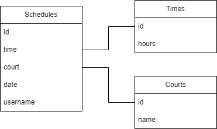

# CanchaTenis

A Tennis Court Manager - Flutter app.


## Project Structure

```
├── lib
│   ├── constants
│   │   ├── colors.dart
│   ├── db
│   │   ├── database.dart
│   │   ├── database.g.dart
│   │   ├── initialize.dart
│   ├── helpers
│   │   ├── alert_dialog.dart
│   ├── models
│   │   ├── create_schedule.dart
│   │   ├── full_schedule.dart
│   ├── screens
│   │   ├── home_screen.dart
│   │   ├── schedule_screen.dart
│   ├── services
│   │   ├── court_service.dart
│   │   ├── forecast_service.dart
│   │   ├── schedule_service.dart
│   │   ├── time_service.dart
│   ├── state
│   │   ├── app_state.dart
│   ├── widgets
│   │   ├── app_scaffold.dart
│   │   ├── court_select.dart
│   │   ├── custom_button.dart
│   │   ├── custom_icon_button.dart
│   │   ├── date_field.dart
│   │   ├── name_field.dart
│   │   ├── schedule_card.dart
│   └── main.dart
├── pubspec.lock
├── pubspec.yaml
```

## DB Schema


